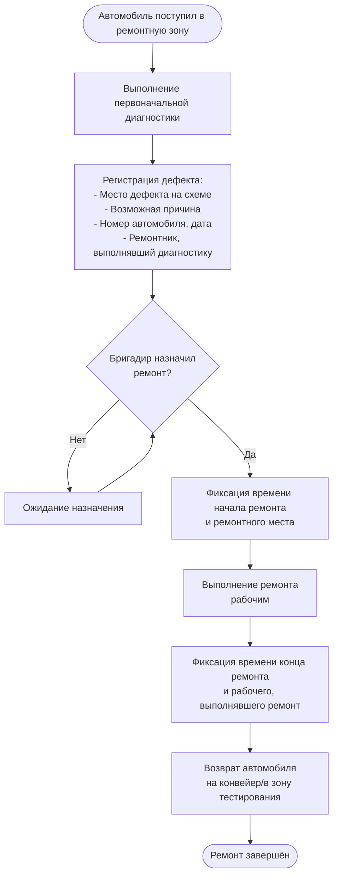
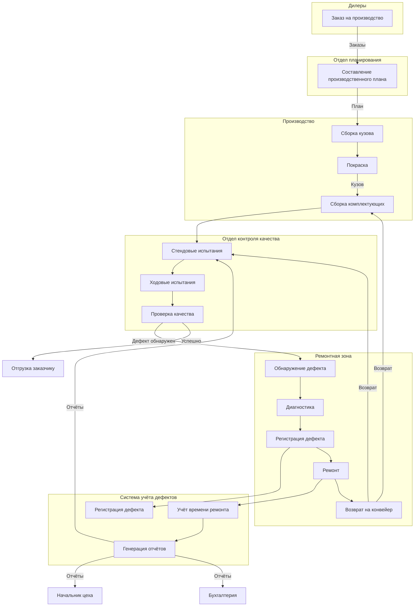
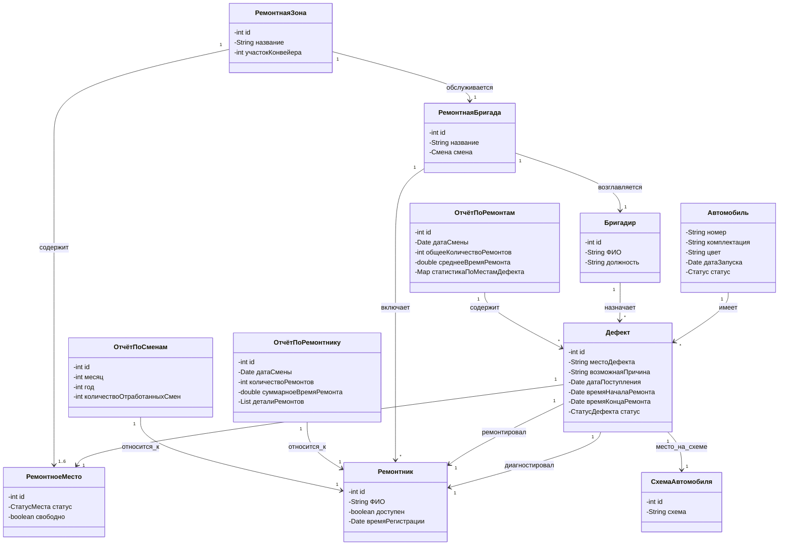
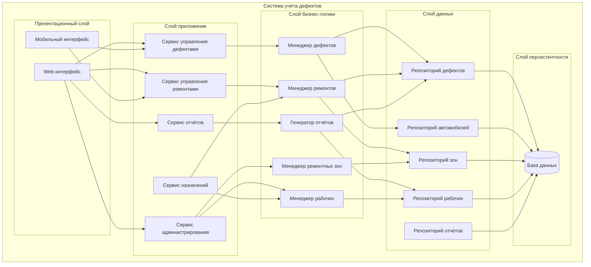
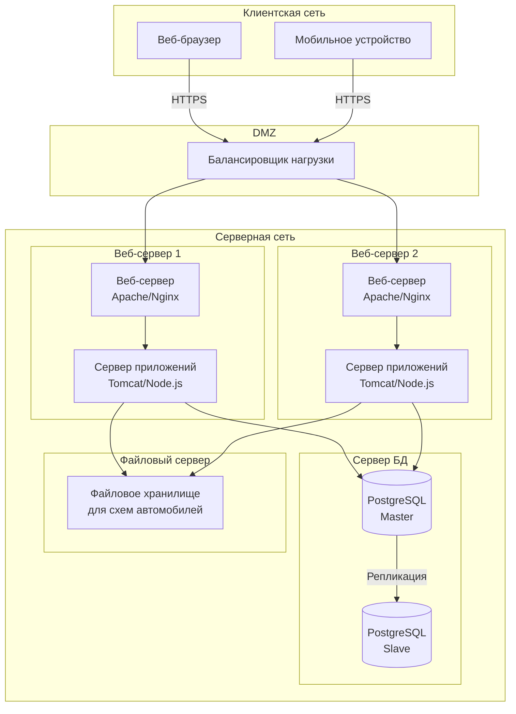
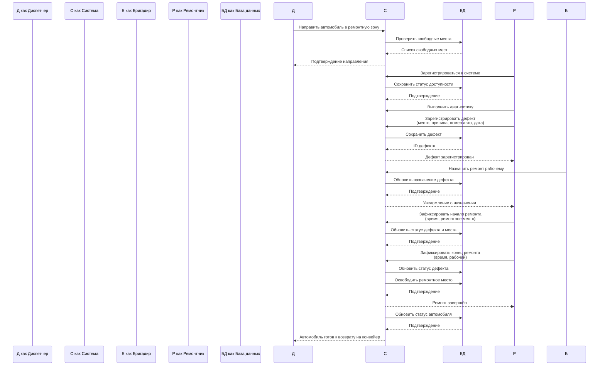

# Диаграммы системы учёта дефектов

## 1. Диаграмма случаев использования (Use Case Diagram)

```mermaid
graph TB
    subgraph Система учёта дефектов
        UC1[Внесение данных о ремонтных зонах]
        UC2[Внесение данных о ремонтных местах]
        UC3[Внесение данных о ремонтных бригадах]
        UC4[Внесение данных о бригадирах]
        UC5[Регистрация дефекта]
        UC6[Фиксация времени ремонта]
        UC7[Назначение ремонта рабочему]
        UC8[Регистрация рабочего в системе]
        UC9[Просмотр свободных мест]
        UC10[Направление автомобиля в ремонтную зону]
        UC11[Получение сводного отчёта по ремонтам]
        UC12[Получение отчёта о количестве ремонтов]
        UC13[Получение информации по ремонтникам]
        UC14[Получение отчёта по отработанным сменам]
    end
    
    Администратор --> UC1
    Администратор --> UC2
    Администратор --> UC3
    Администратор --> UC4
    
    Ремонтник --> UC5
    Ремонтник --> UC6
    Ремонтник --> UC8
    
    Бригадир --> UC7
    Бригадир --> UC13
    
    Диспетчер --> UC9
    Диспетчер --> UC10
    
    ОтделКонтроляКачества --> UC11
    
    НачальникЦеха --> UC12
    
    Бухгалтерия --> UC14
```

## 2. Диаграмма активностей для регистрации и ремонта дефекта (Activity Diagram)

## 3. BPMN-диаграмма для всего бизнес-процесса завода

## 4. Диаграмма классов (Class Diagram)

## 5. Диаграмма компонентов (Component Diagram)

## 6. Диаграмма развёртывания (Deployment Diagram)

## 7. Диаграмма последовательностей регистрации и ремонта дефекта (Sequence Diagram)

