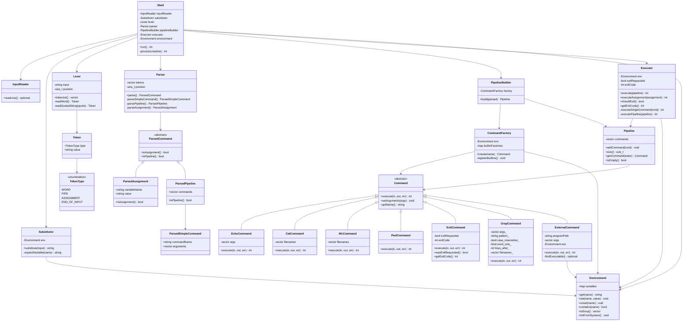
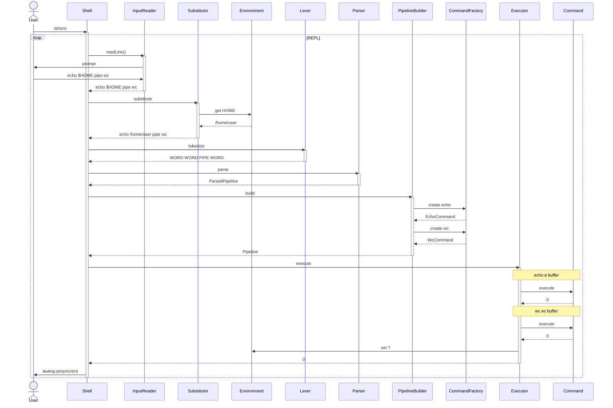
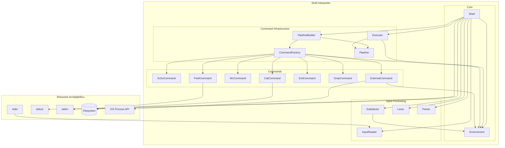
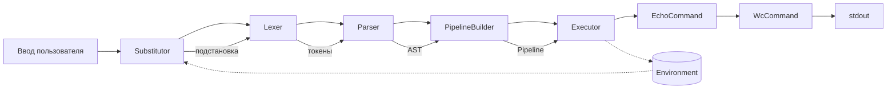

# Архитектурная документация интерпретатора командной оболочки

Документ описывает архитектуру и реализованное поведение CLI Shell Interpreter. Все перечисленные ниже компоненты и сценарии **реализованы в коде** и покрыты юнит- и интеграционными тестами. Соответствие кода и документации поддерживается при изменениях в репозитории.

## Содержание

1. [Обзор системы](#1-обзор-системы)
2. [Общая архитектура](#2-общая-архитектура)
3. [Компоненты системы](#3-компоненты-системы)
4. [Поток выполнения](#4-поток-выполнения)
5. [Подсистема парсинга](#5-подсистема-парсинга)
6. [Подсистема подстановки переменных](#6-подсистема-подстановки-переменных)
7. [Подсистема команд](#7-подсистема-команд)
8. [Подсистема пайплайнов](#8-подсистема-пайплайнов)
9. [Управление окружением](#9-управление-окружением)
10. [Обработка кодов возврата](#10-обработка-кодов-возврата)
11. [Диаграммы](#11-диаграммы)

---

## 1. Обзор системы

### 1.1 Назначение

Система представляет собой интерпретатор командной оболочки (shell), предоставляющий пользователю интерактивный интерфейс для выполнения команд. Интерпретатор поддерживает:

- Встроенные команды (`cat`, `echo`, `wc`, `pwd`, `grep`, `exit`)
- Запуск внешних программ
- Пайплайны (конвейеры команд)
- Переменные окружения и их подстановку
- Присваивание переменных

### 1.2 Основные требования

| Требование | Описание |
|------------|----------|
| Интерактивность | Цикл чтения-выполнения-вывода (REPL) |
| Пайплайны | Поддержка конвейеров команд через `\|` |
| Переменные | Хранение, подстановка и модификация переменных окружения |
| Встроенные команды | Реализация `cat`, `echo`, `wc`, `pwd`, `grep`, `exit` |
| Внешние программы | Запуск любых исполняемых файлов системы |

---

## 2. Общая архитектура

### 2.1 Архитектурный стиль

Система построена по принципу **конвейерной обработки** с чётким разделением ответственности между компонентами. Каждый компонент выполняет одну задачу и передаёт результат следующему.

### 2.2 Высокоуровневая схема

```
┌─────────────────────────────────────────────────────────────────┐
│                         Shell (main)                             │
│  ┌─────────────────────────────────────────────────────────────┐ │
│  │                      REPL Loop                               │ │
│  │                                                              │ │
│  │   ┌──────────┐    ┌────────────┐    ┌──────────────────┐    │ │
│  │   │  Input   │───▶│ Substitutor│───▶│     Lexer        │    │ │
│  │   │  Reader  │    │            │    │                  │    │ │
│  │   └──────────┘    └────────────┘    └────────┬─────────┘    │ │
│  │                                              │              │ │
│  │   ┌──────────┐    ┌────────────┐    ┌───────▼──────────┐    │ │
│  │   │ Executor │◀───│  Pipeline  │◀───│     Parser       │    │ │
│  │   │          │    │  Builder   │    │                  │    │ │
│  │   └──────────┘    └────────────┘    └──────────────────┘    │ │
│  └─────────────────────────────────────────────────────────────┘ │
│                                                                  │
│  ┌─────────────────────────────────────────────────────────────┐ │
│  │                    Environment                               │ │
│  │              (переменные окружения)                         │ │
│  └─────────────────────────────────────────────────────────────┘ │
└─────────────────────────────────────────────────────────────────┘
```

### 2.3 Принципы проектирования

1. **Единственная ответственность (SRP)**: Каждый класс отвечает за одну конкретную задачу
2. **Открытость/закрытость (OCP)**: Новые команды добавляются без изменения существующего кода
3. **Инверсия зависимостей (DIP)**: Компоненты зависят от абстракций, а не от конкретных реализаций
4. **Разделение интерфейса (ISP)**: Компактные интерфейсы для каждой роли

---

## 3. Компоненты системы

### 3.1 Перечень компонентов

| Компонент | Ответственность |
|-----------|-----------------|
| `Shell` | Главный класс, управляющий REPL-циклом |
| `InputReader` | Чтение пользовательского ввода |
| `Substitutor` | Подстановка переменных окружения |
| `Lexer` | Лексический анализ (токенизация) |
| `Parser` | Синтаксический анализ и построение AST |
| `PipelineBuilder` | Создание объектов пайплайнов из AST |
| `Executor` | Исполнение пайплайнов и команд |
| `Environment` | Хранение переменных окружения |
| `Command` | Базовый интерфейс команд |
| `Pipeline` | Представление конвейера команд |

### 3.2 Зависимости между компонентами

```
Shell
  ├── InputReader
  ├── Substitutor ──────▶ Environment
  ├── Lexer
  ├── Parser
  ├── PipelineBuilder ──▶ CommandFactory
  ├── Executor ─────────▶ Environment
  └── Environment
```

---

## 4. Поток выполнения

### 4.1 Главный цикл (REPL)

Точка входа — функция `main()`, которая создаёт объект `Shell` и запускает метод `run()`.

```cpp
int main() {
    Shell shell;
    return shell.run();
}
```

### 4.2 Последовательность обработки команды

```
1. InputReader.readLine()           → std::string (сырая строка)
         │
         ▼
2. Substitutor.substitute()         → std::string (строка после подстановки)
         │
         ▼
3. Lexer.tokenize()                 → std::vector<Token>
         │
         ▼
4. Parser.parse()                   → AST (ParsedCommand)
         │
         ▼
5. PipelineBuilder.build()          → Pipeline
         │
         ▼
6. Executor.execute()               → int (код возврата)
```

### 4.3 Детальное описание шагов

#### Шаг 1: Чтение ввода

`InputReader` читает строку из стандартного ввода. При достижении EOF (Ctrl+D) возвращает признак завершения.

**Входные данные**: `stdin`  
**Выходные данные**: `std::string` (сырая строка пользователя) или признак EOF

#### Шаг 2: Подстановка переменных

`Substitutor` **до токенизации** заменяет все вхождения `$VAR` и `${VAR}` на соответствующие значения из `Environment`.

**Входные данные**: сырая строка  
**Выходные данные**: строка с подставленными значениями переменных

**Важно**: Подстановка выполняется **до** лексического анализа. Это критически важно, так как подставленное значение может содержать пробелы и влиять на токенизацию.

#### Шаг 3: Лексический анализ

`Lexer` разбивает строку на токены с учётом:
- Кавычек (одинарных и двойных)
- Специальных символов (`|`, `=`)
- Пробелов как разделителей

**Входные данные**: строка после подстановки  
**Выходные данные**: `std::vector<Token>`

#### Шаг 4: Синтаксический анализ

`Parser` строит абстрактное синтаксическое дерево (AST) из токенов.

**Входные данные**: `std::vector<Token>`  
**Выходные данные**: `ParsedCommand` (AST)

#### Шаг 5: Построение пайплайна

`PipelineBuilder` создаёт объекты команд через `CommandFactory` и связывает их в пайплайн.

**Входные данные**: `ParsedCommand`  
**Выходные данные**: `Pipeline`

#### Шаг 6: Исполнение

`Executor` выполняет пайплайн и возвращает код возврата последней команды.

**Входные данные**: `Pipeline`  
**Выходные данные**: `int` (код возврата)

---

## 5. Подсистема парсинга

### 5.1 Класс Token

Токен представляет минимальную лексическую единицу.

```cpp
enum class TokenType {
    WORD,           // обычное слово или строка в кавычках
    PIPE,           // символ |
    ASSIGNMENT,     // оператор = (в контексте VAR=VALUE)
    END_OF_INPUT    // конец ввода
};

class Token {
public:
    TokenType type;
    std::string value;
    
    Token(TokenType type, std::string value);
};
```

### 5.2 Класс Lexer

Лексический анализатор выполняет токенизацию входной строки.

```cpp
class Lexer {
public:
    explicit Lexer(const std::string& input);
    
    std::vector<Token> tokenize();
    
private:
    std::string input_;
    size_t position_;
    
    char peek() const;
    char advance();
    void skipWhitespace();
    Token readWord();
    Token readQuotedString(char quote);
};
```

#### 5.2.1 Алгоритм токенизации

1. Пропустить начальные пробельные символы
2. Если текущий символ:
   - `|` → вернуть токен `PIPE`
   - `'` или `"` → прочитать строку до закрывающей кавычки
   - иначе → читать слово до пробела или спецсимвола
3. Повторять до конца строки

#### 5.2.2 Обработка кавычек

| Тип кавычек | Поведение |
|-------------|-----------|
| Одинарные `'...'` | Всё содержимое — литеральная строка, без интерпретации |
| Двойные `"..."` | Подстановка переменных уже выполнена на предыдущем шаге |

**Примечание**: Поскольку подстановка выполняется до токенизации, внутри двойных кавычек переменные уже подставлены.

### 5.3 Класс Parser

Синтаксический анализатор строит AST.

```cpp
class Parser {
public:
    explicit Parser(std::vector<Token> tokens);
    
    ParsedCommand parse();
    
private:
    std::vector<Token> tokens_;
    size_t position_;
    
    Token current() const;
    Token advance();
    bool isAtEnd() const;
    
    ParsedCommand parseCommand();
    ParsedPipeline parsePipeline();
    ParsedSimpleCommand parseSimpleCommand();
    ParsedAssignment parseAssignment();
};
```

### 5.4 Результат парсинга (AST)

```cpp
// Базовый класс для узлов AST
class ParsedCommand {
public:
    virtual ~ParsedCommand() = default;
    virtual bool isAssignment() const { return false; }
    virtual bool isPipeline() const { return false; }
};

// Присваивание переменной: VAR=VALUE
class ParsedAssignment : public ParsedCommand {
public:
    std::string variableName;
    std::string value;
    
    bool isAssignment() const override { return true; }
};

// Простая команда: COMMAND ARG1 ARG2 ...
class ParsedSimpleCommand {
public:
    std::string commandName;
    std::vector<std::string> arguments;
};

// Пайплайн: CMD1 | CMD2 | CMD3
class ParsedPipeline : public ParsedCommand {
public:
    std::vector<ParsedSimpleCommand> commands;
    
    bool isPipeline() const override { return true; }
};
```

---

## 6. Подсистема подстановки переменных

### 6.1 Принцип работы

**Критически важно**: Подстановка переменных выполняется **до токенизации**.

Это означает, что если переменная `$FOO` содержит значение `"hello world"`, то после подстановки строка будет содержать `hello world` (два отдельных слова при токенизации, если не в кавычках).

### 6.2 Класс Substitutor

```cpp
class Substitutor {
public:
    explicit Substitutor(Environment& env);
    
    std::string substitute(const std::string& input) const;
    
private:
    Environment& env_;
    
    std::string expandVariable(const std::string& varName) const;
    bool isValidVarChar(char c) const;
};
```

### 6.3 Алгоритм подстановки

```
Вход: строка S
Выход: строка S' с подставленными переменными

1. result = ""
2. i = 0
3. WHILE i < length(S):
   a. IF S[i] == '$':
      i. IF S[i+1] == '{':
         - Найти закрывающую '}'
         - varName = содержимое между '{' и '}'
         - result += env.get(varName)
         - i = позиция после '}'
      ii. ELSE:
         - Читать символы, пока они допустимы для имени переменной
         - varName = прочитанное имя
         - result += env.get(varName)
         - i = позиция после имени
   b. ELSE IF S[i] == '\'':
      - Найти закрывающую '\''
      - result += содержимое между кавычками (без подстановки)
      - i = позиция после закрывающей кавычки
   c. ELSE:
      - result += S[i]
      - i++
4. RETURN result
```

### 6.4 Обработка кавычек при подстановке

| Контекст | Подстановка $VAR |
|----------|------------------|
| Без кавычек | Выполняется |
| В двойных кавычках `"..."` | Выполняется |
| В одинарных кавычках `'...'` | **Не выполняется** |

### 6.5 Примеры

| Ввод | Переменная X=hello | Результат |
|------|-------------------|-----------|
| `echo $X` | | `echo hello` |
| `echo ${X}` | | `echo hello` |
| `echo "$X world"` | | `echo "hello world"` |
| `echo '$X'` | | `echo '$X'` (без подстановки) |
| `echo $UNDEFINED` | (не определена) | `echo ` (пустая строка) |

---

## 7. Подсистема команд

### 7.1 Интерфейс Command

Все команды реализуют единый интерфейс:

```cpp
class Command {
public:
    virtual ~Command() = default;
    
    // Выполнить команду
    // inputStream — входной поток (может быть пустым или содержать данные от предыдущей команды в пайпе)
    // outputStream — выходной поток для записи результата
    // Возвращает код возврата (0 — успех, иначе — ошибка)
    virtual int execute(
        std::istream& inputStream,
        std::ostream& outputStream,
        std::ostream& errorStream
    ) = 0;
    
    // Установить аргументы команды
    virtual void setArguments(const std::vector<std::string>& args) = 0;
    
    // Получить имя команды
    virtual std::string getName() const = 0;
};
```

### 7.2 Различие аргументов и входного потока

**Критически важно**: Аргументы команды и входной поток — это **разные** вещи.

| Аспект | Аргументы | Входной поток |
|--------|-----------|---------------|
| Источник | Командная строка после имени команды | Результат предыдущей команды в пайпе или `stdin` |
| Передача | При создании объекта команды | При вызове `execute()` |
| Пример | `cat file.txt` → аргумент `file.txt` | `echo hello \| cat` → поток содержит `hello\n` |

### 7.3 Фабрика команд

```cpp
class CommandFactory {
public:
    explicit CommandFactory(Environment& env);
    
    // Создать команду по имени
    // Если имя соответствует встроенной команде — создаёт встроенную
    // Иначе — создаёт ExternalCommand
    std::unique_ptr<Command> create(const std::string& name);
    
private:
    Environment& env_;
    
    std::unordered_map<std::string, 
        std::function<std::unique_ptr<Command>()>> builtinFactories_;
    
    void registerBuiltins();
};
```

### 7.4 Встроенные команды

#### 7.4.1 EchoCommand

```cpp
class EchoCommand : public Command {
public:
    int execute(std::istream& in, std::ostream& out, std::ostream& err) override;
    void setArguments(const std::vector<std::string>& args) override;
    std::string getName() const override { return "echo"; }
    
private:
    std::vector<std::string> args_;
};
```

**Поведение**:
- Выводит аргументы, разделённые пробелами, с завершающим переводом строки
- Входной поток **игнорируется**
- Код возврата: всегда 0

#### 7.4.2 CatCommand

```cpp
class CatCommand : public Command {
public:
    int execute(std::istream& in, std::ostream& out, std::ostream& err) override;
    void setArguments(const std::vector<std::string>& args) override;
    std::string getName() const override { return "cat"; }
    
private:
    std::vector<std::string> filenames_;
};
```

**Поведение**:
- Если есть аргументы (имена файлов): читает и выводит содержимое файлов
- Если аргументов нет: копирует входной поток в выходной
- Код возврата: 0 при успехе, 1 при ошибке (файл не найден)

#### 7.4.3 WcCommand

```cpp
class WcCommand : public Command {
public:
    int execute(std::istream& in, std::ostream& out, std::ostream& err) override;
    void setArguments(const std::vector<std::string>& args) override;
    std::string getName() const override { return "wc"; }
    
private:
    std::vector<std::string> filenames_;
    
    struct Counts {
        size_t lines;
        size_t words;
        size_t bytes;
    };
    
    Counts countStream(std::istream& stream);
};
```

**Поведение**:
- Подсчитывает строки, слова и байты
- Если есть аргументы: обрабатывает указанные файлы
- Если аргументов нет: обрабатывает входной поток
- Код возврата: 0 при успехе, 1 при ошибке

#### 7.4.4 PwdCommand

```cpp
class PwdCommand : public Command {
public:
    int execute(std::istream& in, std::ostream& out, std::ostream& err) override;
    void setArguments(const std::vector<std::string>& args) override;
    std::string getName() const override { return "pwd"; }
};
```

**Поведение**:
- Выводит текущий рабочий каталог
- Аргументы и входной поток **игнорируются**
- Код возврата: 0 при успехе, 1 при ошибке

#### 7.4.5 ExitCommand

```cpp
class ExitCommand : public Command {
public:
    int execute(std::istream& in, std::ostream& out, std::ostream& err) override;
    void setArguments(const std::vector<std::string>& args) override;
    std::string getName() const override { return "exit"; }
    
    // Проверка, была ли вызвана команда exit
    bool wasExitRequested() const { return exitRequested_; }
    int getExitCode() const { return exitCode_; }
    
private:
    bool exitRequested_ = false;
    int exitCode_ = 0;
};
```

**Поведение**:
- Устанавливает флаг завершения работы интерпретатора
- Если передан аргумент — использует его как код возврата
- Иначе — код возврата 0

**Важно**: Команда `exit` **не завершает процесс напрямую**. Она устанавливает флаг, который проверяется в главном цикле REPL. Это позволяет корректно завершить все ресурсы.

#### 7.4.6 GrepCommand

```cpp
class GrepCommand : public Command {
public:
    int execute(std::istream& in, std::ostream& out, std::ostream& err) override;
    void setArguments(const std::vector<std::string>& args) override;
    std::string getName() const override { return "grep"; }

private:
    std::vector<std::string> args_;
    std::string pattern_;
    bool case_insensitive_ = false;
    bool word_only_ = false;
    int lines_after_ = 0;
    std::vector<std::string> filenames_;
    // ...
};
```

**Поведение**:
- Поиск по регулярному выражению (ECMAScript, `std::regex`) в строках ввода или в указанных файлах.
- **-w** — только целое слово (граница: не буква/цифра/подчёркивание по `std::isalnum` и `'_'`).
- **-i** — регистронезависимый поиск (`std::regex::icase`).
- **-A N** — печать N строк после совпадения (-A 0 — только строка совпадения); при пересечении областей строки выводятся один раз.
- Разбор аргументов выполняется с использованием библиотеки CLI11 (определение опций); паттерн и файлы выделяются из `args` вручную, чтобы не смешивать их с именем программы при вызове парсера.

**Коды возврата**: 0 — есть совпадения; 1 — нет совпадений или ошибка файла; 2 — ошибка использования (нет паттерна, неверный -A).

### 7.5 Внешние команды

```cpp
class ExternalCommand : public Command {
public:
    explicit ExternalCommand(const std::string& programPath, Environment& env);
    
    int execute(std::istream& in, std::ostream& out, std::ostream& err) override;
    void setArguments(const std::vector<std::string>& args) override;
    std::string getName() const override { return programPath_; }
    
private:
    std::string programPath_;
    std::vector<std::string> args_;
    Environment& env_;
    
    // Поиск программы в PATH
    std::optional<std::string> findExecutable() const;
};
```

**Поведение**:
1. Ищет исполняемый файл:
   - Если путь содержит `/` — использует как абсолютный или относительный путь
   - Иначе — ищет в директориях, перечисленных в переменной `PATH`
2. Создаёт дочерний процесс через `fork()`
3. В дочернем процессе:
   - Настраивает перенаправление потоков (stdin, stdout, stderr)
   - Передаёт окружение из `Environment`
   - Вызывает `execve()` для запуска программы
4. Родительский процесс ожидает завершения через `waitpid()`
5. Возвращает код возврата дочернего процесса

**Код возврата внешней программы**:
- Если программа завершилась нормально: её exit code
- Если программа не найдена: 127
- Если программа завершилась по сигналу: 128 + номер сигнала

---

## 8. Подсистема пайплайнов

### 8.1 Класс Pipeline

```cpp
class Pipeline {
public:
    Pipeline() = default;
    
    // Добавить команду в конец пайплайна
    void addCommand(std::unique_ptr<Command> command);
    
    // Получить количество команд
    size_t size() const;
    
    // Получить команду по индексу
    Command& getCommand(size_t index);
    
    // Проверить, пуст ли пайплайн
    bool isEmpty() const;
    
private:
    std::vector<std::unique_ptr<Command>> commands_;
};
```

### 8.2 Класс PipelineBuilder

```cpp
class PipelineBuilder {
public:
    explicit PipelineBuilder(CommandFactory& factory);
    
    // Построить Pipeline из AST
    Pipeline build(const ParsedPipeline& parsed);
    
private:
    CommandFactory& factory_;
};
```

### 8.3 Исполнение пайплайна

```cpp
class Executor {
public:
    explicit Executor(Environment& env);
    
    // Выполнить пайплайн, вернуть код возврата
    int execute(Pipeline& pipeline);
    
    // Выполнить присваивание переменной
    int executeAssignment(const ParsedAssignment& assignment);
    
    // Проверить, был ли запрошен exit
    bool shouldExit() const;
    int getExitCode() const;
    
private:
    Environment& env_;
    bool exitRequested_ = false;
    int exitCode_ = 0;
    
    int executeSingleCommand(Command& cmd);
    int executePipeline(Pipeline& pipeline);
};
```

### 8.4 Механизм связывания команд через pipe

При выполнении пайплайна из N команд создаётся N-1 каналов (pipes).

```
Команда 1        Команда 2        Команда 3
┌────────┐      ┌────────┐      ┌────────┐
│        │─────▶│        │─────▶│        │
│ stdout │ pipe1│ stdin  │ pipe2│ stdin  │
│        │      │ stdout │      │ stdout │──▶ terminal
└────────┘      └────────┘      └────────┘
    │
    ◀── stdin (terminal или предыдущий pipe)
```

### 8.5 Алгоритм исполнения пайплайна

```
Вход: Pipeline с командами [C1, C2, ..., Cn]
Выход: код возврата последней команды

1. IF n == 0:
   RETURN 0

2. IF n == 1:
   RETURN executeSingleCommand(C1)

3. Создать массив stringstream-ов для передачи данных между командами

4. FOR i = 0 TO n-1:
   a. Определить входной поток:
      - IF i == 0: stdin или пустой поток
      - ELSE: результат предыдущей команды (stringstream)
   
   b. Определить выходной поток:
      - IF i == n-1: stdout
      - ELSE: stringstream для следующей команды
   
   c. Выполнить команду Ci с этими потоками
   d. Сохранить код возврата

5. RETURN код возврата последней команды Cn
```

### 8.6 Примечания к реализации пайплайнов

**Вариант 1: Последовательное выполнение через буферы**

Каждая команда выполняется полностью, её вывод буферизуется, затем передаётся следующей команде. Простая реализация, но не поддерживает бесконечные потоки данных.

**Вариант 2: Параллельное выполнение через системные pipe**

Команды выполняются параллельно, данные передаются через системные каналы. Сложнее в реализации, но поддерживает потоковую обработку.

Для данного проекта **рекомендуется Вариант 1** ввиду его простоты. Системные pipe потребовались бы для полноценной поддержки внешних команд с большими объёмами данных.

### 8.7 Пустые команды в пайпе и обработка ошибок

- **Пустые имена команд**: при разборе строк вида `| wc` или `echo |` парсер может выдать команды с пустым именем. PipelineBuilder **пропускает** такие команды. В результате `| wc` выполняется как одиночная команда `wc` с пустым stdin.
- **Полностью пустой пайплайн**: если после фильтрации не осталось ни одной команды (например, ввод `|`), Executor не вызывается; в stderr выводится диагностика «empty pipeline», в `$?` устанавливается 2, процесс не завершается.
- **exit в пайпе**: если в пайплайне выполняется команда `exit [n]`, она устанавливает флаг завершения и код выхода; выполнение пайплайна прерывается (оставшиеся команды не запускаются), REPL завершает цикл с указанным кодом.
- **Поток stderr**: каждая команда в пайпе получает один и тот же stderr (например, stderr шелла). Вывод ошибок **не** передаётся по конвейеру следующей команде; только stdout передаётся.

---

## 9. Управление окружением

### 9.1 Класс Environment

```cpp
class Environment {
public:
    Environment();
    
    // Получить значение переменной
    // Возвращает пустую строку, если переменная не определена
    std::string get(const std::string& name) const;
    
    // Установить значение переменной
    void set(const std::string& name, const std::string& value);
    
    // Удалить переменную
    void unset(const std::string& name);
    
    // Проверить, определена ли переменная
    bool contains(const std::string& name) const;
    
    // Получить все переменные (для передачи в exec)
    std::vector<std::string> toEnvp() const;
    
    // Инициализировать из системного окружения
    void initFromSystem();
    
private:
    std::unordered_map<std::string, std::string> variables_;
};
```

### 9.2 Инициализация окружения

При запуске shell:
1. Создаётся объект `Environment`
2. Вызывается `initFromSystem()`, который копирует переменные из `extern char** environ`
3. Устанавливаются специальные переменные:
   - `?` — код возврата последней команды (изначально 0)

### 9.3 Модификация окружения

Переменные модифицируются:
- Командой присваивания: `VAR=value` (в начале строки, без других команд)
- Экспортом (если будет реализован): `export VAR=value`

### 9.4 Передача окружения внешним программам

При запуске внешней программы через `execve()`:
- Формируется массив строк вида `NAME=VALUE`
- Этот массив передаётся как третий аргумент `execve()`

---

## 10. Обработка кодов возврата

### 10.1 Переменная $?

Код возврата последней выполненной команды хранится в специальной переменной `?`.

```cpp
// После выполнения каждой команды
int returnCode = executor.execute(pipeline);
env.set("?", std::to_string(returnCode));
```

### 10.2 Коды возврата для разных ситуаций

| Ситуация | Код возврата |
|----------|--------------|
| Успешное выполнение | 0 |
| Общая ошибка | 1 |
| Неправильное использование команды | 2 |
| Команда не найдена | 127 |
| Программа убита сигналом N | 128 + N |

### 10.3 Код возврата пайплайна

Код возврата пайплайна — это код возврата **последней** команды в конвейере.

```
echo hello | cat | wc
              ↓
    Код возврата = код возврата wc
```

---

## 11. Диаграммы

### 11.1 Диаграмма классов



### 11.2 Диаграмма последовательности (обработка команды)



### 11.3 Диаграмма компонентов



### 11.4 Диаграмма потока данных



---

## Приложение A: Примеры сценариев использования

### A.1 Простая команда

```
Ввод: echo hello world
```

1. **Подстановка**: нет переменных → `echo hello world`
2. **Токенизация**: `[WORD("echo"), WORD("hello"), WORD("world")]`
3. **Парсинг**: `ParsedPipeline{commands: [{name: "echo", args: ["hello", "world"]}]}`
4. **Создание**: `EchoCommand` с аргументами `["hello", "world"]`
5. **Выполнение**: вывод `hello world\n`, код возврата 0

### A.2 Пайплайн

```
Ввод: cat file.txt | wc
```

1. **Подстановка**: нет переменных
2. **Токенизация**: `[WORD("cat"), WORD("file.txt"), PIPE, WORD("wc")]`
3. **Парсинг**: `ParsedPipeline{commands: [{name: "cat", args: ["file.txt"]}, {name: "wc", args: []}]}`
4. **Создание**: `CatCommand(file.txt)`, `WcCommand()`
5. **Выполнение**:
   - `CatCommand` читает файл, выводит в буфер
   - `WcCommand` читает из буфера, выводит статистику

### A.3 Подстановка переменных

```
Ввод: echo "Hello, $USER!"
Окружение: USER=Alice
```

1. **Подстановка**: `echo "Hello, Alice!"`
2. **Токенизация**: `[WORD("echo"), WORD("Hello, Alice!")]`
3. **Парсинг**: `ParsedPipeline{commands: [{name: "echo", args: ["Hello, Alice!"]}]}`
4. **Выполнение**: вывод `Hello, Alice!\n`

### A.4 Присваивание переменной

```
Ввод: FOO=bar
```

1. **Подстановка**: `FOO=bar`
2. **Токенизация**: `[WORD("FOO"), ASSIGNMENT, WORD("bar")]` или специальная обработка
3. **Парсинг**: `ParsedAssignment{name: "FOO", value: "bar"}`
4. **Выполнение**: `env.set("FOO", "bar")`, код возврата 0

### A.5 Внешняя команда

```
Ввод: ls -la
```

1. **Подстановка**: нет переменных
2. **Токенизация**: `[WORD("ls"), WORD("-la")]`
3. **Парсинг**: `ParsedPipeline{commands: [{name: "ls", args: ["-la"]}]}`
4. **Создание**: `ExternalCommand("ls")` (не встроенная команда)
5. **Выполнение**:
   - Поиск `/bin/ls` в PATH
   - `fork()` + `execve("/bin/ls", ["ls", "-la"], environ)`
   - Ожидание завершения, получение кода возврата

---

## Приложение B: Структура файлов проекта

```
shell/
├── CMakeLists.txt
├── include/
│   └── shell/
│       ├── shell.hpp
│       ├── environment.hpp
│       ├── input_reader.hpp
│       ├── substitutor.hpp
│       ├── lexer.hpp
│       ├── token.hpp
│       ├── parser.hpp
│       ├── parsed_command.hpp
│       ├── command.hpp
│       ├── commands/
│       │   ├── echo_command.hpp
│       │   ├── cat_command.hpp
│       │   ├── wc_command.hpp
│       │   ├── pwd_command.hpp
│       │   ├── exit_command.hpp
│       │   ├── external_command.hpp
│       │   └── grep_command.hpp
│       ├── command_factory.hpp
│       ├── pipeline.hpp
│       ├── pipeline_builder.hpp
│       └── executor.hpp
├── src/
│   ├── main.cpp
│   ├── shell.cpp
│   ├── environment.cpp
│   ├── input_reader.cpp
│   ├── substitutor.cpp
│   ├── lexer.cpp
│   ├── parser.cpp
│   ├── commands/
│   │   ├── echo_command.cpp
│   │   ├── cat_command.cpp
│   │   ├── wc_command.cpp
│   │   ├── pwd_command.cpp
│   │   ├── exit_command.cpp
│   │   ├── external_command.cpp
│   │   └── grep_command.cpp
│   ├── command_factory.cpp
│   ├── pipeline.cpp
│   ├── pipeline_builder.cpp
│   └── executor.cpp
└── tests/
    ├── test_lexer.cpp
    ├── test_parser.cpp
    ├── test_substitutor.cpp
    ├── test_commands.cpp
    ├── test_pipeline.cpp
    └── test_integration.cpp
```

---

## Приложение C: Потенциальные проблемы и решения

### C.1 Подводные камни

| Проблема | Описание | Решение |
|----------|----------|---------|
| Порядок подстановки | Подстановка после токенизации приведёт к неправильному разбиению | Подстановка **до** токенизации |
| Кавычки внутри кавычек | Вложенные кавычки могут запутать лексер | Чёткий конечный автомат для обработки состояний |
| Escape-последовательности | `\"` внутри двойных кавычек | Обработка `\` как escape-символа |
| Пустые переменные | `$UNDEFINED` должно заменяться на пустую строку | Проверка в `Environment::get()` |
| Рекурсивная подстановка | `A=$B`, где `B=$A` | Одноуровневая подстановка без рекурсии |
| Буферизация pipe | Большие объёмы данных могут переполнить буфер | Потоковая обработка или лимит буфера |
| Зомби-процессы | Внешние команды могут оставлять зомби | Корректный `waitpid()` с обработкой сигналов |

### C.2 Устойчивость к ошибкам

- **Шелл не должен падать из‑за пользовательского ввода**: весь цикл обработки строки (подстановка → лексер → парсер → построение пайпа → выполнение) обёрнут в try/catch в `processLine`. При любом исключении в stderr выводится диагностика, в `$?` записывается 1, управление возвращается в REPL.
- Ошибки команд (ненулевой код возврата, сообщения в stderr) обрабатываются самими командами и не приводят к падению интерпретатора.

### C.3 Ограничения реализации

- Не поддерживаются фоновые задачи (`&`)
- Не поддерживается перенаправление в файлы (`>`, `<`, `>>`)
- Не поддерживаются составные команды (`if`, `for`, `while`)
- Не поддерживается история команд и автодополнение
